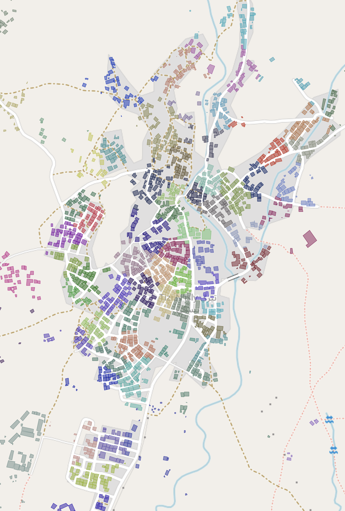
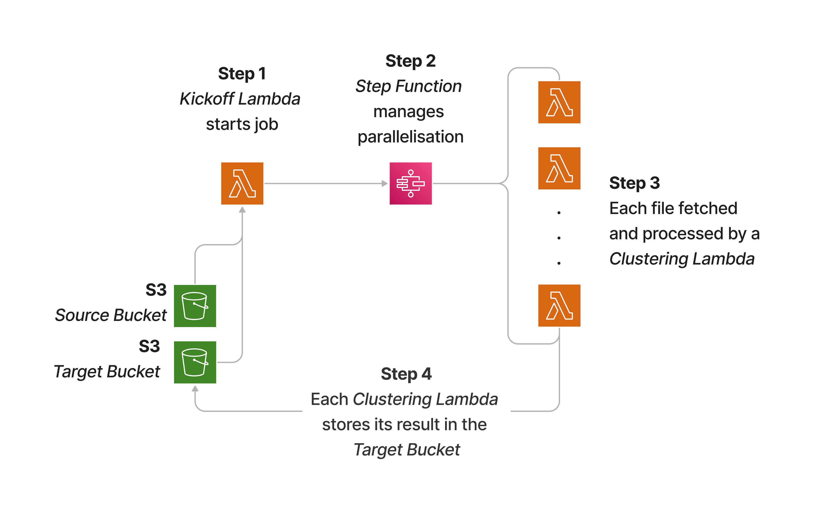

# Weight and Radius Objective-tuned KMeans Clustering

  
  

  <em>Left: Clustering applied to population-weighted grids</em>
  <em>|| Right: Clustering applied to building footprints</em>

This repo holds the code for:

1. The Algorithm: Our latest objective-finetuned KMeans clustering algorithm that produces clusters with weights and radii close to desired values.
2. Running on AWS: Running the clustering code on parallel AWS Lambdas

## 1. The Algorithm

The algorithm is a customized K-means clustering approach that optimizes (using Grid-search) for both cluster **weight** and **radius**, with several key features:

1. **Objective-Function Grid-search Optimization**. Uses `Optuna` to find the optimal number of clusters by minimizing an objective function that balances:
   - Difference between actual and target cluster weights
   - Difference between actual and target cluster radii

    The following formula is used to score each clustering (lower is better):

    $$\text{score} = (f_\text{weight bias} \cdot f_\text{balance}) \cdot |w_\text{target} - w_\text{median}| + |r_\text{target} - r_\text{median}|$$

    Where:
    - $f_\text{weight bias}$: weight importance factor. Above 1 gives penalises weight more, less than 1 penalises radius more.
    - $f_\text{balance}$: Weight-radius balance factor to equalise scales between the two parameters. Equal to $\frac{r_\text{target}}{w_\text{target}}$.
    - $r_\text{target}$: target radius
    - $r_\text{median}$: median cluster radius
    - $w_\text{target}$: target weight
    - $w_\text{median}$: median cluster weight

2. **Multi-pass Approach**. Can rerun repeatedly break up oversized clusters.
   - Initial pass creates clusters based on target weight and radius
   - Subsequent passes break up any oversized cluster that exceeds a specified weight threshold by rerunning the algorithm inside that cluster
   - Process continues until no oversized clusters remain or until the maximum number of passes is reached

3. **Parallelization**: Supports parallel processing for both:
   - The Optuna Grid-search optimization process
   - Re-clustering multiple oversized clusters simultaneously

4. **Key Algorithm Steps**:
   - Determine search space for optimal cluster count based on total weight and target weight
   - Run Optuna study to find optimal number of clusters using Grid-search on Scikit-Learn's `MiniBatchKMeans`
   - Apply clustering with the optimal cluster count
   - Check for and re-cluster oversized clusters if necessary. This generates hierarchical cluster IDs to track the clustering history (e.g. `CLUSTER_001_01`)

5. **Tunable Parameters**:
   - `weight_importance_factor`: Controls the balance between optimizing for weight vs. radius
   - `desired_cluster_weight`: Target weight for each cluster
   - `desired_cluster_radius`: Target radius for each cluster
   - `max_cluster_weight`: Maximum allowed weight before a cluster is considered oversized
   - `max_passes`: Maximum number of re-clustering passes

### Running the demo

- You can install this repo into any environment with `pip install .`
- Then run the notebook `demo/demo.ipynb`. Example datasets are provided for weighted grids and rooftop shapes.
- You can use the main function in your own Python code by importing it like

      from clustering import TunedClustering

  and setting the appropriate parameters (see `demo.ipynb`)

## 2. Running on AWS

### AWS Architecture

Components:

- **S3 buckets**
  - One "input_bucket" for files containing `.parquet` GeoDataFrames to be clustered
  - One "output_bucket" to save clustered files to

- **Kickoff Lambda**: For sending filenames to the Step Function to distribute across clustering Lambdas
  - Code: `aws/kickoff_lambda.py`. Copy this to a new Lambda.
  - Inputs:
    - S3 input bucket name
    - S3 output bucket name
    - Number of files to send for processing

  - Output
        - List of filenames to process

- **Step Function**: For orchestrating the running of one Clustering Lambda per file
  - Code: `aws/state_machine.asl.json`. Copy this to a new Step Function state machine.
  - Inputs:
    - S3 input bucket name
    - S3 output bucket name
    - List of filenames to process automatically sent by Kickoff Lambda
    - Max number of Lambdas to run at once
  - Outputs:
    - Kicks off Clustering Lambdas with the following payload:
      - `{filename:"...", input_bucket:"...", output_bucket:"..."}`

- **Clustering Lambda**: For clustering an input file and saving the output
  - Code: `Dockerfile` and `aws/app.py`.  See "Clustering Lambda Setup" section below for details.
  - Inputs:
    - The following payload `{filename:"...", input_bucket:"...", output_bucket:"..."}`
  - Outputs:
    - Saves clustered file to the output bucket
  - ⚠️ Note: Clustering parameters are currently hardcoded into `aws/app.py`

### Clustering Lambda Setup

#### Docker

##### Build the image

⚠️ Note: Clustering parameters are currently hardcoded into `aws/app.py`. You have to rebuild the image every time you want to change these.

    docker build -t clustering:<VERSION> .

##### Note regarding the Dockerfile

Our Dockerfile is built on a `miniconda` python image because we need to use `conda` to install geopandas since `pip` was failing (due to issues installing the GDAL dependency).

Since we're not using an official AWS Lambda python image, we have to add the "Lambda Runtime Interface Client" so Lambdas can use our image. See these [AWS docs](https://docs.aws.amazon.com/lambda/latest/dg/python-image.html#python-image-clients) for more details.

#### (Optional) Test locally

##### Prepare for emulating Lambdas locally

    mkdir -p ~/.aws-lambda-rie && \
    curl -Lo ~/.aws-lambda-rie/aws-lambda-rie https://github.com/aws/aws-lambda-runtime-interface-emulator/releases/latest/download/aws-lambda-rie && \
    chmod +x ~/.aws-lambda-rie/aws-lambda-rie

##### Run the container locally

    docker run --env-file .env -d \
    -v ~/.aws-lambda-rie:/aws-lambda -p 9000:8080 \
    --entrypoint /aws-lambda/aws-lambda-rie \
    clustering:<VERSION> /opt/conda/bin/python -m awslambdaric app.handler

If you don't want to actually access the S3 buckets, remove the `--env-file .env` flag.

Otherwise, set the following in a `.env` file in root:

    AWS_ACCESS_KEY_ID=
    AWS_SECRET_ACCESS_KEY=

##### Test locally

    curl "http://localhost:9000/2015-03-31/functions/function/invocations" \
    -d '{"filename":"<FILENAME>", "input_bucket":"<INPUT_BUCKET_NAME>",  "output_bucket":"<OUTPUT_BUCKET_NAME>"}'

#### Push Docker image to ECR

##### Tag the image

    docker tag clustering:<VERSION> <ECR_REPO_URL>/clustering:<VERSION>

##### Login

    aws ecr get-login-password --region <AWS-REGION> --profile <YOUR-AWS-PROFILE> | docker login --username AWS --password-stdin <ECR_REPO_URL>

Note - follow these [docs](https://docs.aws.amazon.com/cli/latest/userguide/sso-configure-profile-token.html) if you're not authenticated or run into issues here or in the next step.

Push to ECR with:

    docker push <ECR_REPO_URL>/clustering:<VERSION>

#### Create Lambda

Create a Lambda function from Docker image, select correct image and load. Test it with a suitable payload (see testing locally above).

### Clustering Lambda Performance

Example stats:

    | Grids     | Duration     | Billed Duration  | Max Memory Used |
    |-----------|--------------|------------------|-----------------|
    | 13691     | 8,547.17 ms  | 16,270 ms*       | 422 MB          | 
    | 69226     | 98,398.83 ms | 98,399 ms        | 518 MB          |
    | 101519    | 35,207.47 ms | 42,906 ms*       | 568 MB          | 
    | ^largest  |              |                  |                 |
*Roughly 7-second initialisation time included in billed duration

Based on this, I set the memory to 1024MB and timeout to 5mins.

## Notes

- Input/output buckets are currently hardcoded into:
  - The kickoff Lambda function definition. See `aws/kickoff_lambda.py`.
  - The Step Function inside Parallel Process's Payload editor. Also see `aws/state_machine.asl.json`

Contact: Amir Emami (@amiraliemami - <amir.emami@IDinsight.org>)
